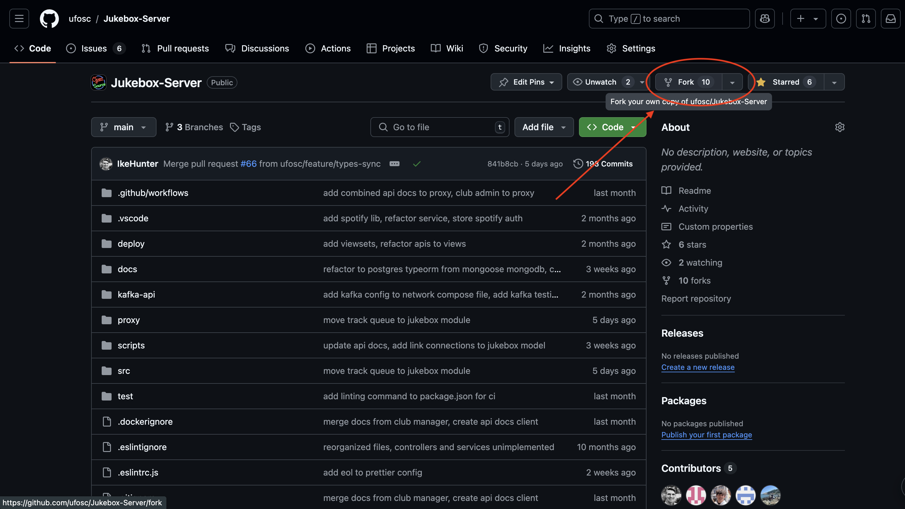
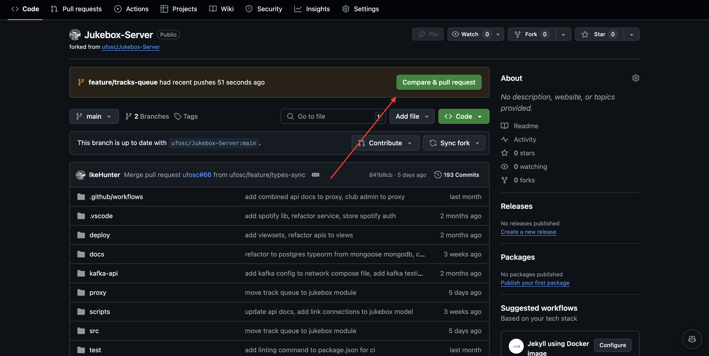

# Making Contributions

## Git Setup

This setup is adapted from <https://github.com/asmeurer/git-workflow>.

The general workflow that is recommended is to do the following:

1. Clone the project
2. Fork the repo
3. Add the fork as a second origin
4. After making changes, push to fork
5. Make PR from fork
6. Pull updates from origin (osc repo)

### Example Workflow

#### Cloning and Forking the Code

Below is an example of how that would work, with the assumption my GitHub username is "mygithub", and the feature I am wanting to work on is adding authentication

Clone the repo locally:

```sh
git clone https://github.com/ufosc/Jukebox-Server.git
```

Fork the repo:



Locally, if you run the following command it should show the OSC repo as the origin:

```sh
git remote -v

# Output:
# origin  git@github.com:ufosc/jukebox-server.git (fetch)
# origin  git@github.com:ufosc/jukebox-server.git (push)
```

It is recommended you use this remote `origin` to pull updates from, this makes it easier to update your local repo. However, when pushing updates to the OSC repo, it is recommended to push updates to your forked repo so you can more easily make pull requests.

To accomplish this, I'll make a new remote called `mygithub` (it is recommended to use your github username):

```sh
git remote add mygithub https://github.com/mygithub/Jukebox-Server.git
```

#### Making Changes

Before making changes, I'll want to create a new git branch. The convention I follow is to use feature branches (not required, it just effects the name of the branch):

```sh
git checkout -b freature/add-auth
```

After making changes to the branch, the next goal will be to create a pull request (PR) from your account to the OSC repo.

First, make sure your changes are saved:

```sh
git add .
git status
git commit -m "add some feature"
```

Then push your branch to your account:

```sh
git push -u mygithub feature/add-auth
```

#### Making a PR

When you go back into your github, it should show something like this:



Clicking on "Compare & pull request" will bring you to a window where you can title the PR and describe the changes you've made. After filling that out, submit the PR.

Once the PR is accepted, make sure to update your local branch with the main repo:

```sh
git pull origin main
```
